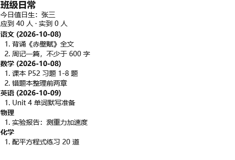
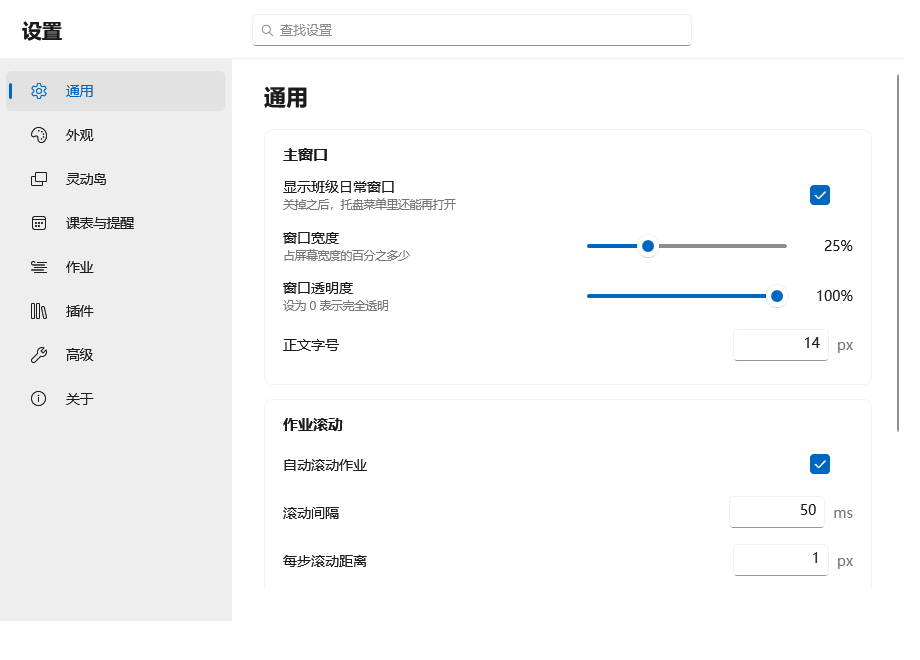
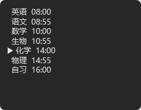
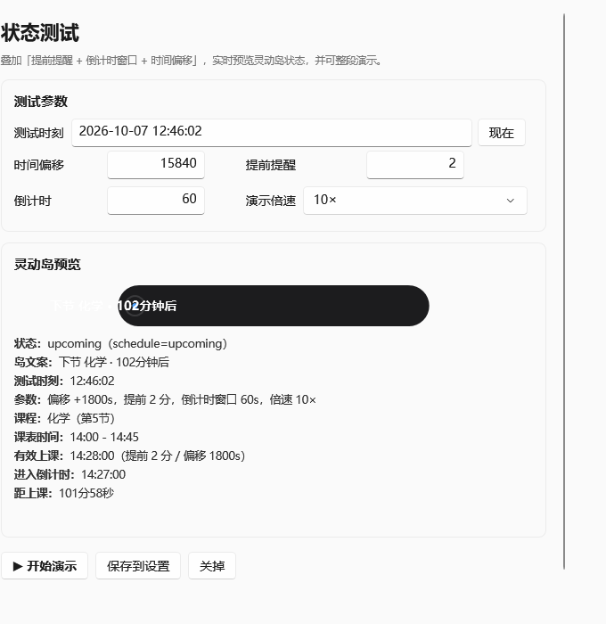
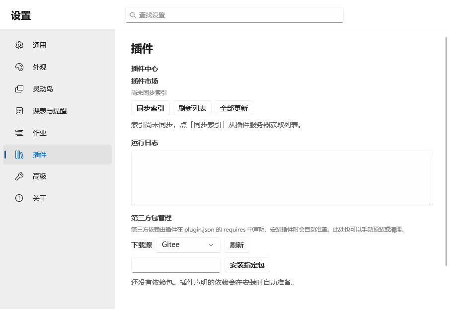
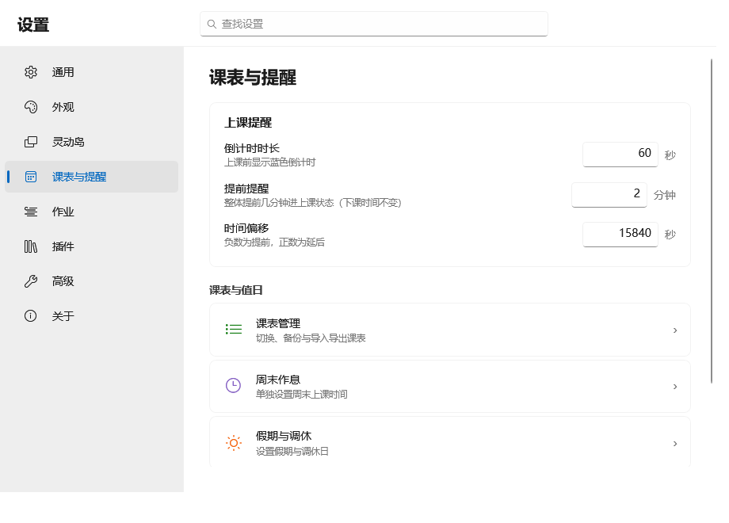
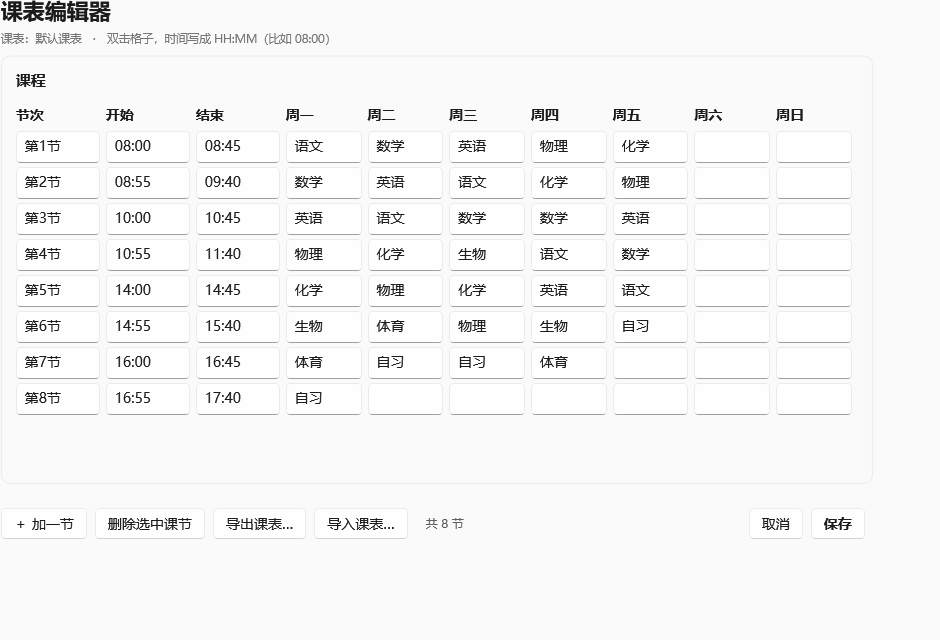
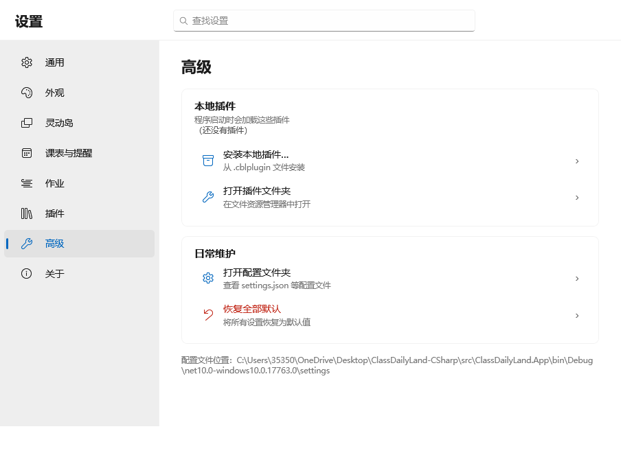
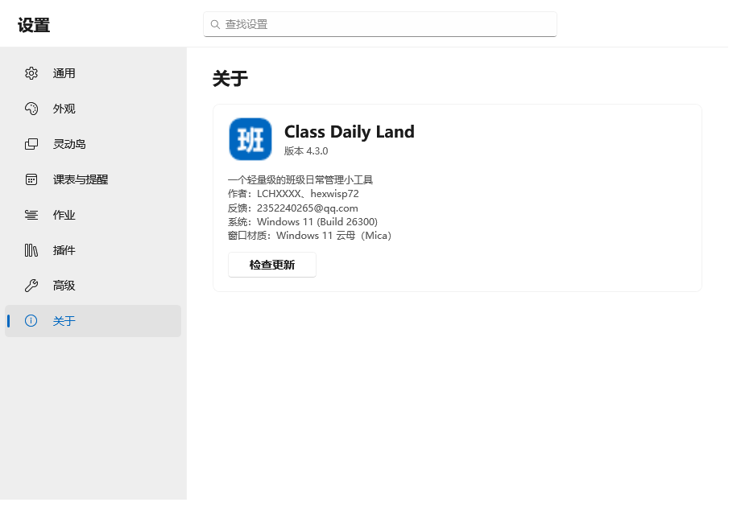
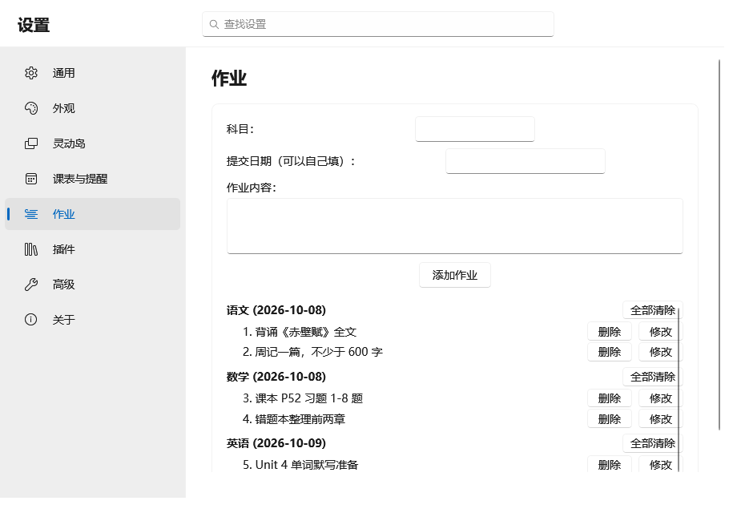

# Class Daily Land · C# / .NET 重写版

> 源项目 `Class-Daily-Land-master`（PySide6 版）的 **C# + WPF** 架构重写。
> 本目录是**独立的新工程**，与源项目完全隔离，不会修改源项目的任何文件。

- **技术栈**：C# / .NET 10 LTS / WPF
- **目标系统**：Windows 10 1809（Build 17763）及以上，兼容 Windows 11
- **当前进度**：第 6 轮 —— 设置中心与课表编辑器逐项对齐源项目
- **测试状态**：208 个单元测试全部通过

---

## 立即测试（无需编译）

已经构建好可直接运行的成品：

```
src\ClassDailyLand.App\bin\Release\net10.0-windows10.0.17763.0\win-x64\publish\ClassDailyLand.exe
```

**把 `ClassDailyLand.exe` 复制到任意文件夹，双击即可运行**（约 76 MB，
已内置 .NET 运行时，目标机器不需要安装任何东西）。

首次运行会在 exe 同级自动创建 `settings\` 目录存放数据；
会弹出用户协议窗口，点「同意，开始使用」后：

- **主窗口**贴在屏幕**右侧**（无边框、不占任务栏，宽度为屏幕的 25%）
- **灵动岛**在屏幕**顶部居中**，深色胶囊 + 左侧进度圆环
- **系统托盘**图标可切换三个窗口的显示、打开设置、退出

右键主窗口可编辑**值日生 / 出勤人数 / 作业**，并打开**设置中心**。
按 `F1` 或托盘菜单「退出」可完全退出程序。

### 界面实拍

| 主窗口（贴右侧） | 灵动岛 | 设置中心（Windows 11 设置风格） |
|---|---|---|
|  |  |  |

| 灵动岛下拉面板 | 副岛 | 状态测试 |
|---|---|---|
|  |  |  |

| 插件市场 | 课表与提醒 |
|---|---|
|  |  |

| 课表编辑器 | 高级 | 关于 |
|---|---|---|
|  |  |  |

| 作业（内嵌编辑器） | 状态测试 |
|---|---|
|  |  |

> 主窗口无标题栏，双击标题栏无法移动 —— 这是与源项目一致的刻意设计。
> 若要调整位置/宽度，请到「设置 → 通用」。

---

## 快速开始（自行编译）

```bash
# 构建
dotnet build

# 运行
dotnet run --project src/ClassDailyLand.App

# 测试
dotnet test

# 发布为单文件 exe（自包含，目标机无需安装 .NET 运行时）
dotnet publish src/ClassDailyLand.App -c Release -r win-x64 \
  --self-contained true \
  -p:PublishSingleFile=true \
  -p:EnableCompressionInSingleFile=true
```

发布产物为**单个 `ClassDailyLand.exe`**，双击即用，可直接分发。

### 界面快照（诊断用）

程序内置了无人值守的界面渲染能力，可在不人工截图的情况下核对外观：

```bash
ClassDailyLand.exe --capture <输出目录>
```

会把主窗口、灵动岛、副岛、下拉面板、设置中心（各页）、状态测试分别渲染为 PNG 后自动退出。

- `--capture-delay <秒>`：先等真实状态机走完一段再截图
- 捕获末尾会以 8 倍速跑一轮情景演示，在倒计时相与提醒恢复后各拍一张
  （`13-scenario-countdown.png` / `14-scenario-after-alert.png`），确定性验证居中与提醒生命周期
- 面板未展开时写状态机现场（`capture-panel-state.txt` / `capture-island-state.txt`），
  崩溃写入 `crash-log.txt`；捕获模式下单实例冲突静默退出，不再弹窗挂住

---

## 目录结构

```
ClassDailyLand-CSharp/
├── ClassDailyLand.slnx               # 解决方案（.NET 10 新格式）
├── Directory.Build.props             # 统一构建约定与 Windows 目标框架
│
├── src/
│   ├── ClassDailyLand.Core/          # 领域层：模型 + 抽象接口（零外部依赖）
│   │   ├── Models/                   # AppSettings / ScheduleDocument / ScheduleStatus / RuntimeConfig ...
│   │   └── Abstractions/             # IPathService / IJsonStore / ISettingsService / IScheduleService ...
│   │
│   ├── ClassDailyLand.Infrastructure/# 基础设施层：数据落盘与业务实现
│   │   ├── Paths/    AppPathService.cs
│   │   ├── Storage/  JsonStore.cs（原子写） / TolerantMerger.cs（逐字段容错）
│   │   ├── Settings/ SettingsService.cs
│   │   ├── Schedule/ ScheduleService.cs / DefaultScheduleFactory.cs
│   │   ├── State/    RuntimeConfigService.cs
│   │   ├── Duty/     DutyService.cs / AttendanceService.cs
│   │   ├── Homework/ HomeworkService.cs
│   │   ├── Market/   MarketService.cs（插件市场）/ RemoteListParser.cs / SemVersion.cs
│   │   │             PluginPackage.cs（包解压与防穿越）/ PackageService.cs（依赖包）
│   │   │             PackageManifest.cs / PackageDownloader.cs / PackageDatabase.cs
│   │   └── Updates/  SourceTreeGuard.cs（源码运行保护）/ UpdateLauncher.cs（更新器）
│   │
│   ├── ClassDailyLand.Plugin.Abstractions/  # 插件契约（独立程序集，插件只需引用它）
│   │   ├── IPlugin.cs / IPluginApi.cs
│   │   ├── PluginManifest.cs（plugin.json）
│   │   └── IslandSpecs.cs（灵动岛扩展点描述）
│   │
│   ├── ClassDailyLand.PluginHost/    # 插件加载：AssemblyLoadContext 隔离加载
│   │   ├── PluginManager.cs
│   │   └── PluginLoadContext.cs
│   │
│   ├── ClassDailyLand.Win32/         # Win32 互操作（Win10 / Win11 能力差异在此收口）
│   │   ├── WindowsVersion.cs         #   真实内核版本探测
│   │   ├── WindowEffects.cs          #   Mica / 深色标题栏 / 圆角（带能力守卫）
│   │   └── ForegroundMonitor.cs      #   全屏检测 / Office 前台检测
│   │
│   └── ClassDailyLand.App/           # WPF 应用：组合根 + 视图 + 协调器
│       ├── App.xaml(.cs)             #   组合根（依赖注入装配）
│       ├── Views/                    #   MainWindow / IslandWindow / SubIslandWindow / AgreementWindow
│       │   ├── Controls/             #   IslandVisual / SubIslandVisual / AppIconFactory（自绘）
│       │   ├── Dialogs/              #   出勤 / 值日生 / 作业 / 课表 / 调休 / 假期 / 周末 / 点名 / 状态测试
│       │   ├── SettingsWindow*.cs    #   设置中心（导航 / 页面 / 市场）
│       │   └── IslandWindow*.cs      #   灵动岛（主状态机 / 下拉面板 / 情景演示）
│       ├── Services/                 #   AppController / PluginRuntime / ThemeBridge / SingleInstanceGuard
│       └── Tray/TrayIconHost.cs      #   系统托盘
│
└── tests/
    └── ClassDailyLand.Tests/         # xUnit 单元测试（208 个）
```

---

## 分层依赖

依赖严格自上而下，领域层与基础设施层**完全不含 WPF 依赖**，
因此核心业务逻辑可跨平台测试（测试项目目标框架为 `net10.0`）。

```
App (WPF)  ──►  PluginHost ──►  Plugin.Abstractions  ──┐
    │               │                                   │
    └───────────────┴──►  Infrastructure  ──►  Core  ◄──┘
                               │
                               └──►  Win32（仅 App 引用）
```

---

## 与源项目的数据兼容

C# 版**刻意对齐了源项目的配置文件格式**（字段名全部保持 snake_case），因此：

- 可以直接读取 Python 版遗留的 `settings/` 数据
- 首次运行生成的 `schedule.json` 与源项目**逐字节完全一致**（已实测验证）

配置文件位置：**exe 同级的 `settings/` 目录**（自包含发布时为 `publish/settings/`），
与源项目互不影响。

| 文件 | 内容 |
|---|---|
| `settings.json` | 应用设置（主题、窗口、灵动岛、动画、插件市场源） |
| `schedule.json` | 课表数据（多课表 / 调课 / 假期 / 调休 / 周末作息） |
| `config.json` | 运行时状态（值日生索引 + 出勤人数） |
| `name.json` | 值日生名单 |
| `homework.json` | 作业列表 |
| `agreement.json` | 用户协议同意状态 |
| `plugin-repo/` | 插件市场索引缓存（三个来源各自的 list.json） |
| `plugins/packages/` | 第三方依赖包与其登记表 `packages.json` |

---

## 已实现

### 界面（已与源项目逐项对齐）
- ✅ **主窗口**：无边框、贴屏幕右边缘、高度随内容自适应
  - 标题「班级日常」+「今日值日生：X」+「应到 X 人 · 实到 X 人」
  - 作业按科目分组：粗体「科目 (日期)」标题 + 带序号条目「  1. 内容」
  - 内容溢出时自动滚动（间隔 / 步长 / 到底暂停次数均可配）
  - 右键菜单与源项目**逐项一致**（含分隔线位置）
- ✅ **灵动岛**：240×40 深色胶囊（#1c1c1e）+ 左侧 28px 进度圆环
  - 圆环配色与源项目一致：未到上课 `#4da3ff` / 上课中 `#30d158` / 其它 `#8a8a8e`
  - 文案逐字对齐：`下节 X · N分钟后`、`本节：X 还剩 N分钟`、`假期中 · X`、`今日无课`、`今日课程已结束`
  - 倒计时态展开到 **600px** 并整条填充蓝色进度（#0a84ff）
  - 唤醒动画：屏幕上方滑入 → 迷你态（48px 圆点）→ 展开为胶囊
  - 文字变化时滚动切换；文字溢出时跑马灯（32 px/s）
  - 全屏应用前台自动休眠；WPS/Office 前台**仅**退出倒计时
  - 状态切换提醒：`上课了！`、放假日 `放假啦，撒花 🎉`（下课不提醒，与源项目一致）
  - **点击下拉面板**：课表预览（`▶` 标记当前节次）+ 插件内容，错峰展开、3 秒自动收回、点击外部关闭
  - **情景演示**：一键在真实灵动岛上跑完整一轮（提前提醒 → 倒计时 → 上课 → 下课 → 恢复）
- ✅ **副岛**：主岛右侧扩展区，跟随主岛几何定位；无内容时收成 40px 圆并显示「—」
- ✅ **系统托盘**：三窗口显隐切换、设置、添加插件、假期与调休、周末作息、退出
- ✅ **设置中心**：**Windows 11 设置风格**左导航（圆角选中块 + 蓝色强调条 + 图标）
  - 顶部条带**「查找设置」搜索框**（按 Enter 打开第一项，Esc 返回）
  - 8 个页面：通用 / 外观 / 灵动岛 / 课表与提醒 / 作业 / 插件 / 高级 / 关于
  - **页面按「卡片」分组**，每张卡片是一组相关设置 —— 分组、行标签、提示文案、
    取值范围全部逐项对齐 `settings_dialog_v4.py`，不自行增删
  - **入场动画**：页面整体淡入上浮、逐行错峰 30ms；导航切换做颜色与高度过渡
  - 动画时长与开关读取「外观 → 淡入淡出」页设置
  - 控件类型也对齐：宽度 / 透明度用滑块（百分比）、颜色模式用分段按钮（中文标签）
  - 设置项即时保存并立即生效，无需重启
  - Windows 11 下启用云母材质，Windows 10 自动跳过（外观页显示说明文字）
  - 插件注册的设置页会自动出现在导航中
- ✅ **编辑对话框**（对应 `menu.py` 的 8 个对话框）
  值日生名单 / 出勤人数 / 作业增删改 / 课表管理 / 课程编辑 / 临时调课 / 假期与调休 / 周末作息
- ✅ **随机点名器**（对应 `randoms.py`）
- ✅ **状态测试**（对应 `test_dialog.py`）
  叠加「提前提醒 + 倒计时窗口 + 时间偏移」实时预览灵动岛状态，并可整段演示

### 核心与基础设施
- ✅ 分层解决方案骨架（6 个项目 + 1 个测试项目）
- ✅ 路径管理、JSON 原子读写、逐字段容错合并
- ✅ 设置服务（含类型不符逐字段回退默认值）
- ✅ 课表服务（多课表 / 临时调课 / 假期 / 调休 / 周末作息 / 时间偏移）
- ✅ **课表状态机 `GetStatus()`**：`upcoming` / `ongoing` / `done` / `none` / `holiday`
  （支持参数覆盖，供状态测试在不落盘的前提下试算）
- ✅ **课表导入导出**：JSON / CSV，支持单套课表与完整备份（假期 / 调休 / 周末一并导出）
  - CSV 表头与源项目 `CSV_HEADERS` 一致，导出后能原样再导入（CRLF、10 列）
  - **导入预览**：先看文件类型、课表构成、附带设置与警告，再选导入方式
    （合并 = 同名自动改名「xx (导入)」；覆盖 = 只替换同名课表；完整备份可整体恢复）
- ✅ 值日生轮转（跨天自动前进、索引越界自动归位）
- ✅ 出勤人数、作业管理（含历史格式自动升级）
- ✅ 单实例锁、用户协议门禁
- ✅ Win32 层：内核版本探测、Mica / 深色标题栏 / 圆角（Win10 自动降级）、
  全屏与 Office 前台检测、鼠标按键状态检测

### 插件体系
- ✅ 插件契约 + `AssemblyLoadContext` 隔离加载 + 宿主侧能力聚合
- ✅ **`.cblplugin` 包自动安装**：放进 `plugins/` 即解压成插件目录，
  按「标记文件 → 包内 id/name → 文件名词干」推断目录名（保证与市场索引对得上）
- ✅ **插件市场**（对应 `plugin_market.py`）
  - 三个索引来源：官方服务器 / GitHub / Gitee，按优先级回退；联网全挂时退回本地缓存
  - 语义化版本比较（正式版 > 同号预发布版，数字段排在字母段之前）
  - 脏数据不丢条目：索引记录有问题照样显示，标注原因并禁用安装
  - 下载展开镜像候选（GitHub 直链自动换成 jsDelivr 优先）、SHA-256 校验、备份后原子换入
  - 批量更新、卸载、启用 / 禁用
- ✅ **依赖包管理**（对应 `plugin_deps.py` / `package_store.py`）
  - 清单校验 → 依赖闭包（后序安装、环依赖剪枝）→ 多镜像下载（边下边算 sha256）→ 原子换入
  - 登记表 `packages.json` 与 `used_by` 引用计数：最后一个使用方卸载时才回收目录
  - 手动安装的包不随插件卸载回收

### 更新链路
- ✅ **源码运行保护**（对应 `dev_guard.py`）
  - 判定信号：主入口文件名 / 内容特征（核心类型引用 + `Main(` / `Application.Run`）/ 工程文件
  - 命中即拦下自动更新，启动时静默说明、手动检查时弹窗提醒备份并请求确认
- ✅ **更新器拉起与退出信号**（对应 `launch_updater.py`）
  - 以 `--target <程序目录> --pid <进程号> [--silent]` 拉起 `Launcher.exe`
  - 轮询 `%TEMP%/ClassDailyLandLauncher/quit.flag`，收到即自行退出

### 工程能力
- ✅ **界面快照诊断**（`--capture`）：无人值守核对外观，面板未展开时附状态机现场

---

## 已修复的关键缺陷

| 缺陷 | 原因 | 修复 |
|---|---|---|
| **主窗口消失，重启后不再显示** | 应用退出时 WPF 会关闭所有窗口并触发 `Closing`，被误判为「用户关闭窗口」而把 `show_main_window` 写成 `false`，污染了配置 | 关闭主窗口一律只隐藏、**绝不改动配置**（源项目也没有这个行为） |
| 主窗口布局与源项目不符 | 做成了居中带标题栏的普通窗口 | 改为无边框、贴屏幕右边缘、高度自适应，文案逐字对齐 |
| 作业区域看不到 | 布局结构与源项目不同，且窗口位置错误 | 按源项目重做：头部三行固定 + 作业区独立滚动 |
| 灵动岛外观不符 | 做成了「圆点 + 文本」的简易版，没有进度圆环、没有胶囊尺寸概念 | 改为完全自绘：240×40 胶囊 + 28px 进度圆环 + 精确配色 |
| 全屏时灵动岛行为不符 | 误将 Office 前台也当作隐藏条件 | 全屏 → 休眠；Office 前台 → 仅退出倒计时（与源项目一致） |
| **课表时间与灵动岛显示对不上** | 「时间偏移」模型层缺少 ±1800 秒 / 0–60 分钟的夹取（源项目 `set_time_offset_seconds` / `set_advance_minutes` 有），越界值（诊断脚本遗留 / 手工改配置）静默生效，编辑器显示原始时间、灵动岛按越界偏移显示 | 模型层补上夹取；加载时发现越界值自动归位并回写；设置页数字框与源项目 `QSpinBox` 一样自带范围、越界当场夹回 |
| **「上课了」弹出后卡住不动** | 视觉层的提醒文字只在进入时设置、从不清除（`ClearAlert` 无人调用），绘制分支永远命中提醒态；且提醒期间沿用倒计时的 600px 宽度 | 提醒走完整生命周期：停填充时钟 → 动画到提醒条宽度（300）→ 到期清除窗口侧与视觉层文字 → 恢复常规（对应源项目 `_show_alert` / `_alert_return`） |
| **倒计时 / 提醒条展开时挤到右边** | 只动画宽度，`Left` 一步跳到终值 —— 胶囊从固定左缘向右生长 | `Left` 与宽度做同步动画（对应源项目 `_animate_to` 的 `target = QRect(_center_x(w), ...)`），始终以屏幕中线对称展开 |
| **触屏拖不动** | 只做了滚轮滚动，触屏平移与拖拽滚动没有对应物（源项目 `ui_common.py` 的 `setup_touch_scroll` / `install_touch_scrolling`） | 全局样式打开 `ScrollViewer.PanningMode` + 逐像素滚动；主窗口作业区与设置导航加「按住拖动 + 惯性衰减」；手动滚动时自动滚动暂停 4 秒 |

---

## 与源项目的已知差异

界面与逻辑都按源项目逐项对齐过。以下是**刻意保留**的差异，都属于「做了会更好、不做也不影响」的取舍：

| 差异 | 源项目 | 本工程 | 原因 |
|---|---|---|---|
| 设置窗口标题栏 | 自定义标题栏 + 返回按钮（页面栈导航） | 保留系统标题栏；导航平铺、无返回按钮 | 导航本来就全部可见，返回按钮没有意义；自绘标题栏要自己实现拖动 / 最小化 / 最大化 / 贴边，收益不抵风险 |
| 设置窗口导航层级 | 二级页收在父页里（`in_nav=False`） | 插件市场 / 第三方包管理直接展开在「插件」页内，分区标题保持与源项目一致 | 同上：导航平铺时不需要层级跳转 |
| 课表编辑器单元格 | 需双击才进入编辑态 | 常驻输入框（单击即可改） | 少一步操作；外观上仍是表格样式 |
| 依赖包的归档格式 | Python wheel（含 CPython ABI 自检） | `.nupkg` / `.zip` 优先；遇到 `.whl` 明确拒绝并说明原因 | .NET 宿主加载不了 `.py` / `.pyd`，装上也没用 |
| 插件本体 | Python 模块（`main.py`） | .NET 程序集（`main.dll`） | 语言改写的必然结果，见下一节 |

---

## 关于插件生态的重要说明

源项目的插件是 **Python** 模块（`plugin.json` + `main.py`），
而 C# 版插件是 **.NET 程序集**（`plugin.json` + `main.dll`）。这是改写的必然结果。

因此：

- **机制完整可用**：`.cblplugin` 包格式、清单校验、市场索引、安装/更新/卸载、
  依赖解析与引用计数全部移植到位，端到端只差「发布 .NET 版插件的服务器」。
- **现有服务器上的插件装得上、但加载不了**：它们含的是 `.py`，宿主找不到入口程序集。
  此时插件页会明确显示「加载失败：找不到入口程序集」，而不是静默失败。
- **依赖包同理**：源项目的依赖清单分发的是 Python wheel（还带 CPython ABI 自检），
  .NET 版把「单文件归档」定义为 `.nupkg` / `.zip` 优先；
  遇到 `.whl` 会**明确拒绝并说明原因**，而不是解压一堆宿主用不上的 `.py` 后假装成功。

---

## 后续轮次

详见 [`docs/迁移对照与路线图.md`](docs/迁移对照与路线图.md)。

- **样例插件工程**：端到端验证插件体系（含设置页、灵动岛扩展点、依赖声明）
- **启动性能优化**：ReadyToRun / 延迟加载
- **应用图标与安装包**
- **发布流水线**

---

## 开发约定

- **不要直接编辑 `obj/`、`bin/`**：均为生成产物。
- **新增设置项**：在 `AppSettings` 上加属性并标注 `[JsonPropertyName("snake_case")]`，
  容错合并器会自动处理类型校验与默认值回退，无需改动其它代码。
- **新增 Win32 能力**：在 `ClassDailyLand.Win32` 中实现，并**必须提供能力守卫**
  （能力不足时返回 `false` 而不是抛异常），由调用方决定降级策略。
- **插件 API 变更**：修改 `IPluginApi` 后需同步递增 `PluginApiVersion.Current`。

---

*本工程为学习与班级管理用途。源项目采用 MIT 许可证。*
